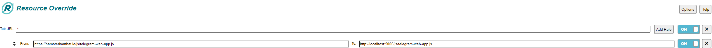
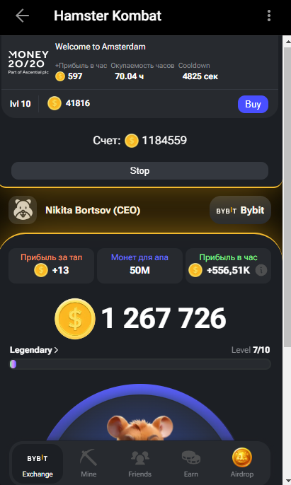

> [!NOTE]
> Contacts: [Telegram](https://t.me/bonnysid)
>
> RU README на русском [here](README.md)
---
## How to Run

- Install [node.js](https://nodejs.org/en)
- Clone the repository or download it
- Open and run in terminal `npm install`
- Start with `node index.js`
- Install the [Resource Override](https://chromewebstore.google.com/detail/resource-override/pkoacgokdfckfpndoffpifphamojphii) extension in your browser
- Open the extension settings and enter the following data:
- Tab URL: `*` From: `https://hamsterkombat.io/js/telegram-web-app.js` To: `http://localhost:5000/js/telegram-web-app.js`
- 
- [Open the bot](https://web.telegram.org/k/#?tgaddr=tg%3A%2F%2Fresolve%3Fdomain%3Dhamster_kombat_bot%26appname%3Dstart%26startapp%3DkentId563525859) and start the game

### Open [Hamster Kombat Bot](https://web.telegram.org/k/#?tgaddr=tg%3A%2F%2Fresolve%3Fdomain%3Dhamster_kombat_bot%26appname%3Dstart%26startapp%3DkentId563525859) and start the game

## 

> [!IMPORTANT]
> Donation
>
> We accept the following cryptocurrencies:
>
> - **TON**: `EQDD8dqOzaj4zUK6ziJOo_G2lx6qf1TEktTRkFJ7T1c_fPQb`
>
> - **USDT**(TRC20): `TCwLYBkNUX3zfNZmtUUrKkYaRyvWkQMVEV`
>
> - **USDT**(TON): `EQDD8dqOzaj4zUK6ziJOo_G2lx6qf1TEktTRkFJ7T1c_fPQb`
>
> - **NOTCOIN**(TON): `EQDD8dqOzaj4zUK6ziJOo_G2lx6qf1TEktTRkFJ7T1c_fPQb`
>
> - **BTC**: `1M2KDGSuyTowG1M1twZDaqxhF2Bnp938J9`
>
> Donations will be used to support and maintain the project.
